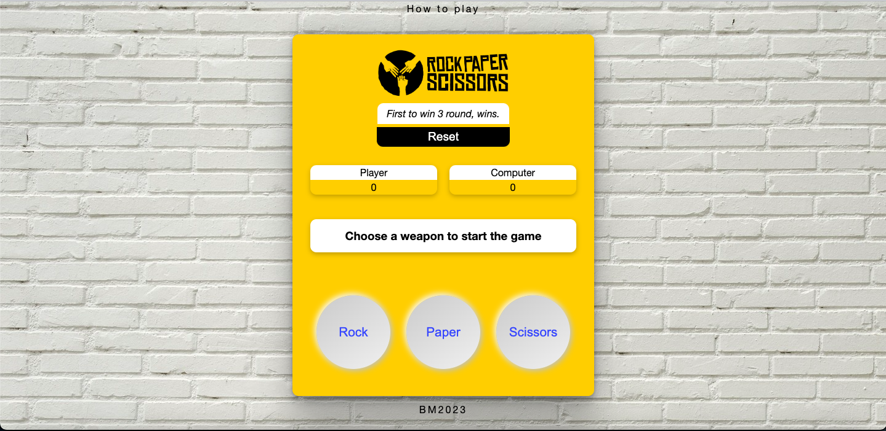

# rock_paper_scissors-game

## [Demo](https://bbm2910.github.io/rock_paper_scissors-game/)

## Compatibility and Requirements
1. Web - a modern web browser (e.g., Chrome, Firefox, Safari, Edge) with a desktop or laptop display.
2. Mobile Devices 

Made with HTML, CSS and JavaScript.
Rock Paper Scissors Game is a simple web-based implementation of the classic game "Rock, Paper, Scissors." It allows two players to compete against each other and determine the winner based on their choices.
Features
Two players can participate in the game.
Each player can choose one of the three options: rock, paper, or scissors.
The game determines the winner based on the chosen options and keeps track of each player's score.
Players can choose to play multiple rounds.
The game displays the winner of each round and the overall winner and also provides an option to reset the scores and start a new game.

## Getting Started
To get started with the Rock Paper Scissors Game, follow these steps:

### Clone or download the [repository](https://github.com/bobby2910/Rock-Paper-Scissors-GAME)
Navigate to the project directory.
Open the index.html file in a web browser.

## How to Play
Once the game is loaded in your web browser, it will display the game interface.
Player 1 and Player 2 take turns selecting their choices by clicking on the corresponding buttons (rock, paper, or scissors).
After both players have made their choices, the game determines the winner and updates the scores.
Enjoy playing Rock Paper Scissors!
